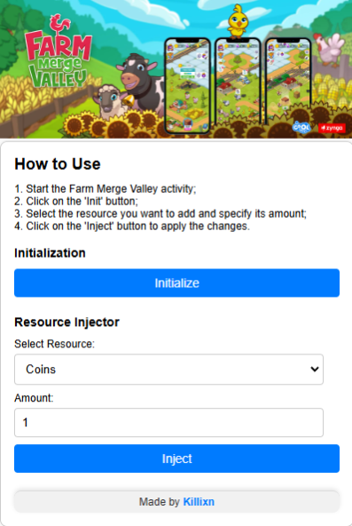

<p align="center">
  
</p>

<h1 align="center">[Discord] - FarmMergeValley Chrome Extension</h1>

The FMV Chrome Extension provides a user-friendly graphical interface (GUI) for easier interaction with the initial repository: [FarmMergeValley Injector](https://github.com/AstraaDev/FarmMergeValley-Injector).
Please note that this project is still under active development. At the moment, only the front-end of the Chrome extension has been implemented. The backend, which requires injecting JS code into the web console, is still under development and is not yet functional.

---

## Features

- [x] **Active exclusively on `discord.com` pages**: The extension only runs when you're on Discord's web pages.
- [ ] **Injects resources into the game**: The backend, which will inject JS code into the console to provide game resources.
- [ ] **giveInventoryItem**: Function to give inventory items directly through the interface.
- [x] **Customizable item configuration**: Users will be able to customize the items injected into the game, including quantities and types.
- [ ] **Console-based commands**: Future support for running custom commands in the console via the extension.
- [x] **Improved UI/UX**: Ongoing development for a more intuitive and responsive graphical interface.

---

## How To Setup/Install

1. **Clone the repository**:
   ```bash
   git clone https://github.com/AstraaDev/FMV-ChromeExtension.git
   ```
2. **Load the extension in Chrome**:
   - Open Chrome and navigate to `chrome://extensions/`.
   - Enable "Developer mode" in the top right corner.
   - Click "Load unpacked" and select the folder from the project directory.

---

## Example Chrome Extension


---

## Additional Information
- Need help? Join the [Discord Server](https://discord.gg/PKR7nM9j9U).
- Contributions are welcome! Open an issue or create a pull request.
